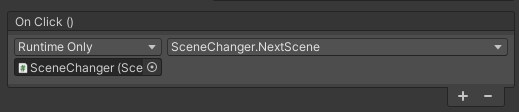

# Utilities

## Scene Changer
The `SceneChanger` is a simple class that allows to change scenes with three simple functions. Simply attach this script to an empty GameObject in the Scene and then you could call it for example from a button.

### Example
Create a empty GameObject and call it SceneChanger and add the `SceneChanger.cs` script to it. Create a canvas and a button and add a new OnClick function. Drag the SceneChanger object into to slot on the left and select a function from the drop down on the right.

### Functions
- `void ChangeScene(string scene)` 
  Change the scene by passing the name of the new scene. The name should be as it appears in the build settings
- `void ChangeScene(int sceneIndex)` 
  Change the scene by passing the index of the new scene. The index should be as it appears in the build settings, were 0 is the startup scene
- `void NextScene()`
  This will load the next scene in the build settings order. This can be useful if the game has multiple levels each in a separate scene and you want to jump to the next level